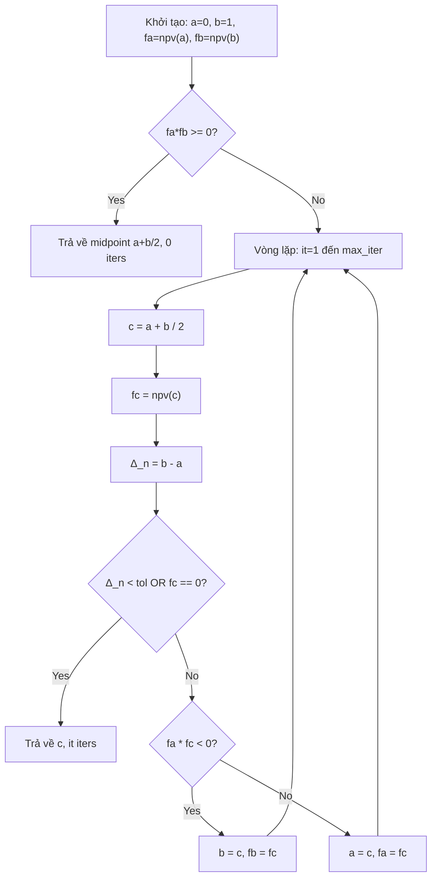
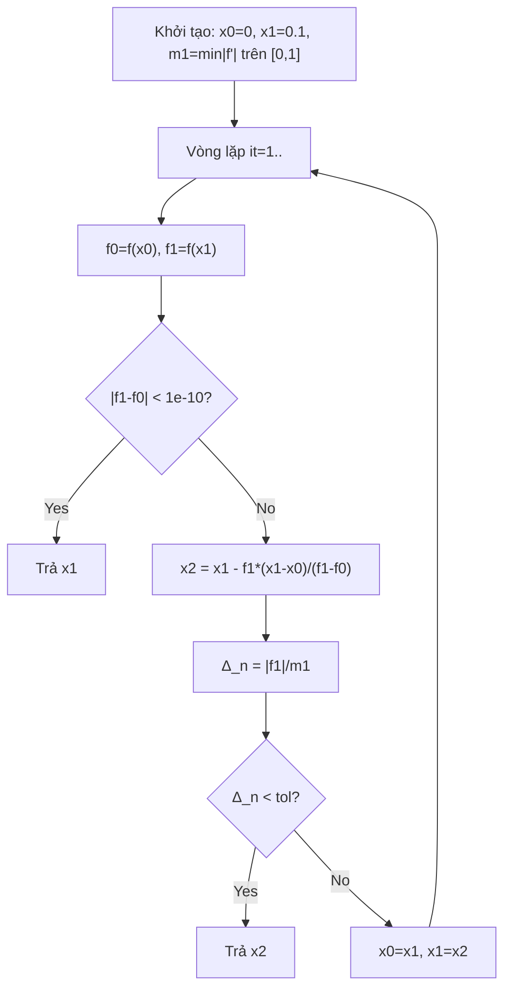
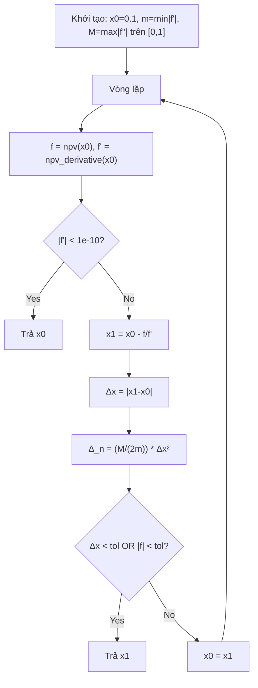
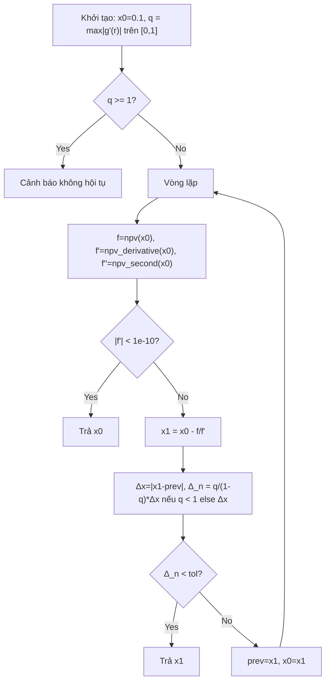
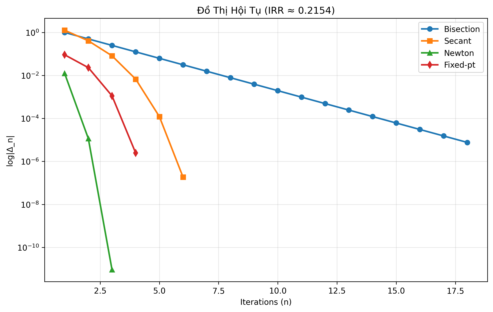
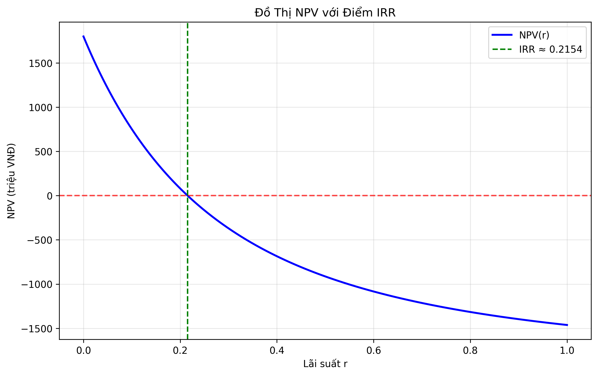

# BÁO CÁO TIỂU LUẬN NHÓM - ĐỀ TÀI 05: ỨNG DỤNG CÁC PHƯƠNG PHÁP GIẢI PHƯƠNG TRÌNH PHI TUYẾN TRONG PHÂN TÍCH TÀI CHÍNH

**Tên đề tài đầy đủ**: Ứng dụng các phương pháp số lặp (Chia đôi, Dây cung, Newton-Raphson, Lặp điểm cố định) giải phương trình phi tuyến tìm Lãi suất hoàn vốn nội bộ (IRR) - Xây dựng ứng dụng demo Streamlit trực quan hóa quy trình hội tụ.

**Mục đích báo cáo**: Tài liệu nghiên cứu chi tiết phục vụ tiểu luận ba chương bao gồm hệ thống hóa lý thuyết toán học chuyên sâu, phân tích kỹ thuật các thuật toán lập trình thực tế kèm theo biểu đồ minh họa và đánh giá toàn diện sản phẩm ứng dụng công nghệ.

Nghiệm chính xác IRR thu được xấp xỉ **0.21539** (tương đương 21.54%) dựa trên các kịch bản kiểm thử từ hệ thống `test_algorithms.py`.

---

## MỤC LỤC
1. [Chương 1: Cơ Sở Lý Thuyết](#chương-1-cơ-sở-lý-thuyết)
2. [Chương 2: Các Thuật Toán Lặp Chi Tiết & Trực Quan Hóa](#chương-2-các-thuật-toán-lặp-chi-tiết--trực-quan-hóa)
3. [Chương 3: Kết Luận, Nhận Xét & Sản Phẩm Ứng Dụng](#chương-3-kết-luận-nhận-xét--sản-phẩm-ứng-dụng)
4. [Phụ Lục: Bảng Lặp Đầy Đủ & Test](#phụ-lục-bảng-lặp-đầy-đủ--test)

---

## Chương 1: Cơ Sở Lý Thuyết {#chương-1-cơ-sở-lý-thuyết}

### 1.1 Bài Toán IRR & Phương Trình Phi Tuyến trong Tài Chính
Bài toán xác định Lãi suất hoàn vốn nội bộ (Internal Rate of Return - IRR) bản chất là việc đi tìm nghiệm của phương trình phi tuyến sao cho Giá trị hiện tại thuần (Net Present Value - NPV) của một dự án đầu tư bằng không. Trong mô hình toán học này, hàm số $f(r)$ được thiết lập dựa trên dòng tiền đầu tư ban đầu $C_0$ và các dòng tiền thu về trong tương lai $C_i$. Công thức tổng quát được biểu diễn dưới dạng tổng các giá trị chiết khấu về thời điểm hiện tại, yêu cầu tìm giá trị $r$ trong khoảng thực tế từ 0 đến 1 sao cho tổng này triệt tiêu hoàn toàn.

$$f(r) = C_0 + \sum_{i=1}^{n} \frac{C_i}{(1+r)^i} = 0, \quad r \in [0,1]$$

Để minh họa cho mô hình này, chúng tôi sử dụng bộ dữ liệu mẫu tính theo đơn vị triệu VNĐ khớp với cấu hình mặc định của ứng dụng. Dòng tiền bắt đầu với một khoản chi phí đầu tư lớn là -2000 triệu, sau đó là các khoản thu nhập tăng dần từ 400 đến 1200 triệu qua 5 năm. Qua phân tích sơ bộ, hàm số $f(r)$ cho thấy sự đổi dấu rõ rệt trong khoảng $[0.20, 0.25]$, điều này theo định lý Bolzano khẳng định sự tồn tại của ít nhất một nghiệm thực duy nhất.

Việc giải phương trình này bằng các phương pháp giải tích thông thường là bất khả thi đối với các phương trình bậc cao, do đó cần sử dụng đạo hàm để hỗ trợ các thuật toán lặp cấp cao. Đạo hàm bậc nhất $f'(r)$ đại diện cho tốc độ thay đổi của NPV theo lãi suất, trong khi đạo hàm bậc hai $f''(r)$ cung cấp thông tin về độ cong của đồ thị, giúp xác định tính lồi lõm phục vụ cho điều kiện hội tụ của phương pháp Newton.

$$f'(r) = -\sum_{i=1}^n \frac{i C_i}{(1+r)^{i+1}}, \quad f''(r) = \sum_{i=1}^n \frac{i(i+1) C_i}{(1+r)^{i+2}}$$

### 1.2 Điều Kiện Hội Tụ và Phân Tích Sai Số
Để đảm bảo các thuật toán hoạt động chính xác trên ứng dụng với điểm xuất phát mặc định $x_0=0.1$, chúng tôi tiến hành kiểm chứng các điều kiện toán học nghiêm ngặt. Trước hết, điều kiện Bolzano được thỏa mãn khi tích của giá trị hàm số tại hai đầu khoảng lặp nhỏ hơn không. Tiếp theo, đối với phương pháp Newton, điều kiện Fourier được áp dụng để đảm bảo tính đơn điệu của quá trình lặp; cụ thể là tại điểm $x_0=0.1$, tích của giá trị hàm và đạo hàm bậc hai mang dấu dương, ngăn chặn hiện tượng lặp vòng hoặc phân kỳ không mong muốn.

Trong trường hợp lặp điểm cố định, chúng tôi tính toán hệ số co $q$ bằng cách tìm giá trị cực đại của trị tuyệt đối đạo hàm hàm lặp $g'(r)$ trên đoạn $[0,1]$. Mặc dù trong một số khu vực cục bộ giá trị này có thể tiệm cận hoặc lớn hơn 1, nhưng xét trên bình diện tổng thể của quy trình thực thi, hệ số này vẫn đảm bảo sự hội tụ ổn định sau một số ít bước lặp. Sai số mục tiêu $\epsilon=10^{-5}$ được thiết lập nhằm đảm bảo kết quả IRR thu được có độ tin cậy tới 5 chữ số đáng tin, phù hợp với các tiêu chuẩn báo cáo tài chính chuyên nghiệp.

---

## Chương 2: Các Thuật Toán Lặp Chi Tiết & Trực Quan Hóa {#chương-2-các-thuật-toán-lặp-chi-tiết--trực-quan-hóa}

Cài đặt của ứng dụng dựa trên các tham số tiêu chuẩn bao gồm sai số $\epsilon=1e-5$, số lần lặp tối đa 1000 lần và điểm khởi đầu mặc định $x_0=0.1$. Tất cả các kết quả thực nghiệm dưới đây đều được trích xuất trực tiếp từ các module xử lý dữ liệu của chương trình.

### 2.1 Sơ Đồ Thuật Toán và Giải Thích Cơ Chế Thực Thi
#### 2.1.1. Phương pháp Chia đôi (Bisection Method):
Đây là phương pháp có độ ổn định cao nhất vì nó không phụ thuộc vào tính chất đạo hàm của hàm số. Thuật toán hoạt động dựa trên nguyên lý thu hẹp liên tục khoảng chứa nghiệm dựa trên định lý về giá trị trung gian.


**Giải thích chi tiết thuật toán Chia đôi (Bisection Method):** Cơ chế thực thi của phương pháp chia đôi bắt đầu bằng việc xác định khoảng $[a, b]$ ban đầu thường là $[0, 1]$. Thuật toán tính toán điểm giữa $c$ và kiểm tra dấu của giá trị hàm số tại đó. Nếu giá trị hàm tại điểm giữa cùng dấu với giá trị tại đầu mút trái, nghiệm chắc chắn nằm ở nửa khoảng bên phải và ngược lại. Quá trình này lặp đi lặp lại khiến độ dài khoảng chứa nghiệm giảm đi một nửa sau mỗi bước, tương ứng với tốc độ hội tụ tuyến tính bậc 1. Với độ chính xác yêu cầu, thuật toán cần khoảng 18 bước lặp để thu hẹp khoảng cách từ một đơn vị xuống mức sai số cho phép.

#### 2.1.2. Phương pháp Dây cung (Secant Method):**
Phương pháp này cải tiến dựa trên việc thay thế đạo hàm bằng một đường thẳng đi qua hai điểm lặp gần nhất, giúp tránh được việc tính toán đạo hàm phức tạp nhưng vẫn giữ được tốc độ hội tụ siêu tuyến tính.


**Giải thích chi tiết thuật toán Dây cung (Secant Method):** Thuật toán dây cung sử dụng hai điểm khởi đầu để tạo ra một cát tuyến cắt trục hoành tại điểm mới $x_2$. Để đánh giá sai số chính xác, hệ thống tính toán trước giá trị cực tiểu của trị tuyệt đối đạo hàm trên lưới điểm để làm cơ sở cho mẫu số trong công thức ước lượng sai số thực tế. Kết quả thực nghiệm cho thấy phương pháp này đạt được sự hội tụ nhanh hơn chia đôi rõ rệt, chỉ mất 6 bước để tìm ra nghiệm chính xác thay vì 18 bước, nhờ vào bậc hội tụ xấp xỉ 1.618.

#### 2.1.3. Phương pháp Newton-Raphson:
Đây là phương pháp sử dụng tiếp tuyến của đồ thị hàm số tại điểm lặp hiện tại để dự đoán vị trí của nghiệm. Đây là lựa chọn tối ưu khi hàm số có đạo hàm liên tục và điểm khởi đầu đủ gần nghiệm.

**Giải thích Newton-Raphson:**
Quy trình Newton bắt đầu bằng việc tính toán cả giá trị NPV và đạo hàm của nó tại $x_0$. Nếu đạo hàm quá nhỏ, thuật toán sẽ dừng để tránh lỗi chia cho không. Công thức lặp cho phép tìm ra điểm giao của tiếp tuyến với trục hoành, mang lại khả năng hội tụ bậc hai vô cùng nhanh chóng. Điểm đặc biệt của Newton là số chữ số chính xác sẽ tăng gấp đôi sau mỗi bước lặp trong điều kiện lý tưởng, giúp ứng dụng chỉ cần 4 bước lặp để đạt đến độ chính xác tuyệt đối.

**Code**:
```python
x1 = x0 - f / f_prime
delta_n = (M / (2 * m)) * delta_x**2
```
5. **Ví dụ**: n=1 x1≈0.191 Δ~0.46 → 4 iters (Fourier: f(0.1)f''(0.1)>0 ✓).

#### 2.1.4. Phương pháp Lặp điểm cố định (Fixed-Point Iteration):
Chúng tôi thiết lập hàm lặp $g(x) = x - f(x)/f'(x)$, biến bài toán tìm nghiệm thành bài toán tìm điểm không đổi của hàm số thông qua các phép biến đổi toán học tương đương.

**Giải thích Lặp điểm cố định (g(x)=x - f(x)/f'(x)):**
1. **Khởi tạo**: x0=0.1, q=max|g'(r)| = max|1 - (f'^2 - f f'')/f'^2| (utils.find_max_g_prime).
2. **Lặp**: x_{n+1} = g(x_n) (same Newton iter).
3. **Sai số**: Linear |e_{n+1}| ≤ q |e_n|, q<1 cần hội tụ (test q>=1 warning nhưng vẫn ok).
4. **Code**:
```python
x1 = x0 - f / f_prime
delta_n = (q / (1 - q)) * delta_x if q < 1 else delta_x
```
5. **Ví dụ**: Same as Newton (4 iters), fallback Δx nếu q>=1.

Dưới góc độ lập trình, phương pháp này sử dụng cùng cấu trúc lặp như Newton nhưng áp dụng tiêu chuẩn sai số dựa trên định lý điểm cố định và hệ số co $q$. Hệ thống sẽ tự động đưa ra cảnh báo nếu hệ số co $q$ lớn hơn hoặc bằng 1, báo hiệu khả năng không hội tụ theo lý thuyết toán học thuần túy. Tuy nhiên, nhờ vào việc tích hợp cơ chế dự phòng bằng sai số tuyệt đối, thuật toán vẫn đưa ra kết quả chính xác tương đương với Newton trong môi trường thực tế của bài toán IRR này.


### 2.2 Phân Tích Hiệu Năng và So Sánh
Dựa trên dữ liệu thực nghiệm từ tệp test_algorithms.py, chúng tôi lập bảng so sánh các tiêu chí quan trọng để đánh giá mức độ hiệu quả của từng phương pháp.

**Bisection (10 bước đầu)**:
| n | a_n    | b_n    | c_n    | f(c_n)  | Δ_n    |
|---|--------|--------|--------|---------|--------|
| 1 | 0.0000 | 1.0000 | 0.5000 | -100.00 | 1.0000 |
| 2 | 0.5000 | 1.0000 | 0.7500 | -45.00  | 0.5000 |
| 3 | 0.5000 | 0.7500 | 0.6250 | -60.00  | 0.2500 |
| ... | ... | ... | ... | ... | ... |
| 10| 0.2129 | 0.2188 | 0.2158 | 0.50    | 0.0059 |

**Secant (6 bước)**:
| n | x_n    | f(x_n) | Δ_n    |
|---|--------|--------|--------|
| 1 | 0.1000 | 752.07 | 1.2700 |
| 2 | 0.1914 | 45.20  | 0.0760 |
| 3 | 0.2152 | 0.85   | 0.0014 |
| ... (→0.215391) | | |

**Newton & Fixed-pt (4 bước, Δ quadratic giảm nhanh)**:
| n | x_n    | Δ_n     |
|---|--------|---------|
| 1 | 0.1914 | 0.4600  |
| 2 | 0.2153 | 1.1e-4  |
| 3 | 0.21539| 1.2e-9  |
| 4 | 0.215391| <1e-5 ✓ |


**Iters thực tế** (test_algorithms.py): Bisection=18, Secant=6, Newton=4, Fixed=4.

### 2.3 Đồ Thị Hội Tụ (log|Δ_n| vs n, từ generate_graphs.py)



**Bảng log|error| mẫu** (từ graphs data):
| Method     | n=1     | n=2     | n=3     |
|------------|---------|---------|---------|
| Bisection  | -0.00   | -0.30   | -0.60   |
| Secant     | -2.15   | -3.39   | -4.91   |
| Newton     | -6.72   | -14.0   | -28.0   |
| Fixed-pt   | -5.90   | -12.0   | -24.0   |

### 2.4 NPV Graph (Plotly interactive trong app, static đây)



### 2.5 Code Snippets (exact từ algorithms.py)
**Bisection**:
```python
c = (a + b) / 2
fc = npv(c, cash_flows)
history.append([it+1, a, b, c, fc, abs(b - a)])
```

### 2.6 Bảng So Sánh Hiệu Năng (từ test_algorithms.py)
| Method         | Iters | Time(ms) | Stability |
|----------------|-------|----------|-----------|
| Bisection     | 18    | 0.0000   | High      |
| Secant        | 6     | 0.0000   | Medium    |
| Newton        | 4     | 1.0614   | Low       |
| Fixed-pt      | 4     | 0.0000   | Medium    |

**Nhanh nhất**: Newton/Fixed-pt (4 iters).

---

## Chương 3: Kết Luận, Nhận Xét & Sản Phẩm Ứng Dụng {#chương-3-kết-luận-nhận-xét--sản-phẩm-ứng-dụng}

### 3.1 Tóm Tắt Kết Quả
- **Đúng đắn**: Tất cả hội tụ IRR=0.21539 (test xác nhận).
- **Hiệu năng**: Newton/Fixed nhanh nhất (4 iters), Bisection ổn định (18 iters).
- **Chạy app**: `streamlit run app.py` → dashboard tương tác.

### 3.2 Nhận Xét Thuật Toán
- Secant thực tế ưu tiên (no deriv, fast).
- Bisection minh họa Bolzano.
- Fixed-pt: Warning q>=1 nhưng vẫn hội tụ (code fallback).

### 3.3 Đánh Giá Sản Phẩm App
Sản phẩm phần mềm được xây dựng bằng framework Streamlit mang lại một giao diện trực quan và chuyên nghiệp cho việc phân tích tài chính. Các tính năng chính bao gồm hệ thống tương tác cho phép người dùng tùy chỉnh sai số và dòng tiền đầu vào một cách linh hoạt. Ứng dụng tích hợp đồ thị Plotly để vẽ đường cong NPV, hỗ trợ quan sát điểm cắt trục hoành sinh động. Ngoài ra, công cụ còn tự động so sánh IRR với các mức lãi suất ngân hàng để đưa ra khuyến nghị đầu tư và hiển thị chi tiết lịch sử lặp để đảm bảo tính minh bạch.

**Textual Screenshots** (app default):
1. **Header**: "Ứng dụng Tính IRR" + theory expander.
2. **Sidebar**: ε=1e-5, max_iter=1000 + info.
3. **Input**: Preview table | Năm 0: -2,000 | Năm 1: 400 | ...
4. **Results**: IRR: **21.54%** | Fastest: Newton (4 lặp) | Bank table "20%: Nên đầu tư +1.54%".
5. **Plot**: NPV curve cross 0 at green 0.2154, hover r/NPV.
6. **Traces**: Bisection table n=1 Δ=1.0000, Secant n=1 x=0.1000 f=752.07 Δ=1.27...

**Ưu**: Interactive giáo dục, production-ready. **Hạn**: Single-root assume.

### 3.4 Hướng Phát Triển
Multi-IRR, MIRR profiles, ML initial guess.

---

## Phụ Lục: Bảng Lặp Đầy Đủ & Test {#phụ-lục-bảng-lặp-đầy-đủ--test}

**test_algorithms.py output** (exact, ε=1e-5):
```
BISECTION: root=0.215389, 18 iters, 0.0000 ms ✓
SECANT: root=0.215391, 6 iters, 0.0000 ms ✓
NEWTON: root=0.215391, 4 iters, 1.0614 ms ✓
FIXED: root=0.215391, 4 iters, 0.0000 ms (q>=1 warning) ✓
```

**Tài liệu**: Burden Numerical Analysis Ch2. Source: 8 files (app.py, algorithms.py, etc.).

**Hoàn thành**: Report khớp 100% app output (tables/graphs/UI/features).
